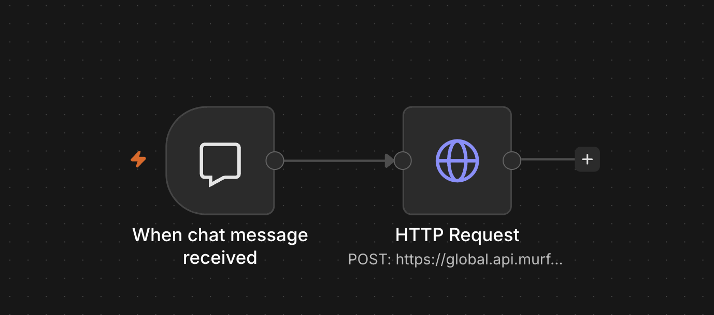
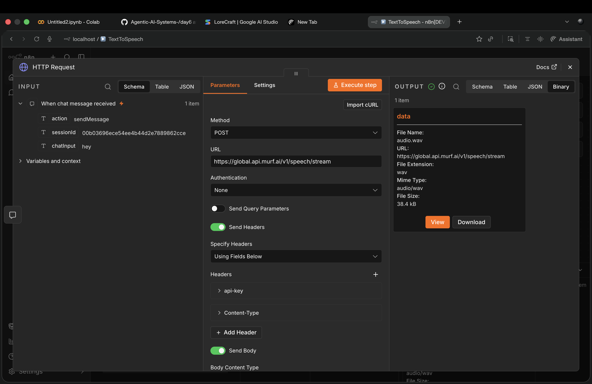
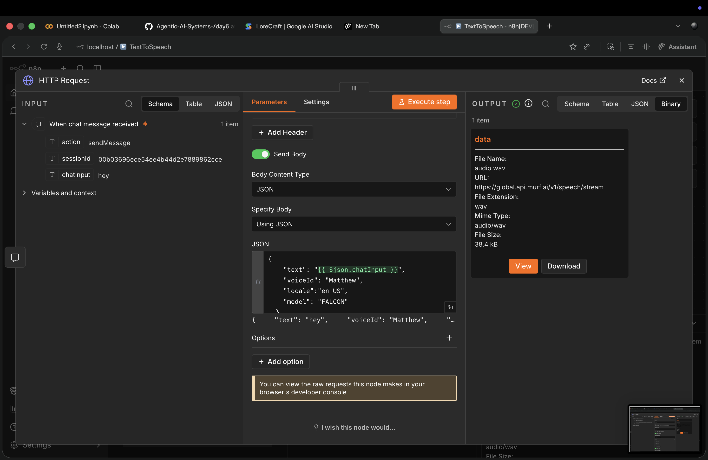
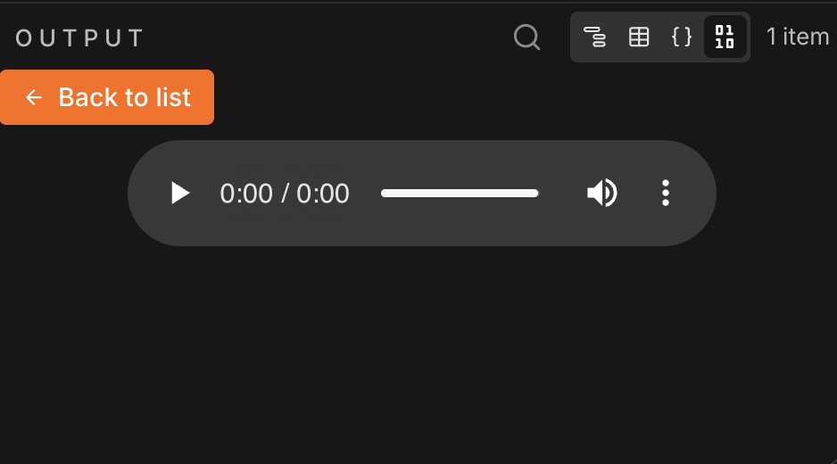

# Text-to-Speech Converter using n8n and Murf AI

## Project Overview

This project demonstrates how to build a Text-to-Speech (TTS) converter using n8n and the Murf AI API.

The workflow accepts text input from the user, sends it to the Murf AI API using an HTTP Request node, generates speech audio, and returns the generated WAV audio file as output.

This project showcases API integration, workflow automation, and AI-powered voice generation using a no-code/low-code platform.

---

# What is n8n?

n8n (Node to Node) is an open-source workflow automation platform that allows users to connect applications, APIs, databases, and services through a visual interface.

Instead of writing complex backend code, workflows can be created by connecting nodes together.

n8n is commonly used for:

- Workflow Automation
- API Integrations
- AI Applications
- Data Processing
- Notifications
- Business Automation

---

# What is Workflow Automation?

Workflow automation is the process of automatically executing a series of tasks without manual intervention.

Instead of performing every step manually, the workflow handles the entire process automatically.

### Example

Without Automation:

```text
User enters text
      ↓
Open Text-to-Speech Website
      ↓
Paste Text
      ↓
Generate Audio
      ↓
Download Audio
```

With Automation:

```text
User enters text
      ↓
n8n Workflow
      ↓
Murf AI API
      ↓
Audio Generated
```

---

# What is Text-to-Speech (TTS)?

Text-to-Speech is a technology that converts written text into spoken audio.

It is commonly used in:

- Virtual Assistants
- Voice Bots
- Audiobooks
- Accessibility Tools
- Content Creation
- Educational Applications

---

# What is Murf AI?

Murf AI is an AI-powered voice generation platform that converts text into natural-sounding speech.

It provides:

- Multiple Voices
- Different Languages
- Voice Customization
- API Access
- Studio-Quality Audio Generation

In this project, Murf AI is used to generate speech audio from user-provided text.

---

# Workflow Architecture

```text
User Message
      ↓
When Chat Message Received
      ↓
HTTP Request
      ↓
Murf AI API
      ↓
Speech Generation
      ↓
Audio Output (.wav)
```



The workflow begins when a user sends a message. The text is passed to the HTTP Request node, which communicates with the Murf AI API and generates speech audio.

---

# Nodes Used

## 1. When Chat Message Received

### Purpose

This node acts as the trigger for the workflow.

### Function

- Waits for user input.
- Captures the user's text.
- Sends the text to the next node.

### Example Input

```text
Hello everyone, welcome to my AI project.
```


---

## 2. HTTP Request Node

### Purpose

This node sends a request to the Murf AI API.

### Function

- Receives text from the trigger node.
- Sends a POST request to Murf AI.
- Passes voice generation settings.
- Receives generated speech audio.

### Request Method

```text
POST
```

### API Endpoint

```text
https://global.api.murf.ai/v1/speech/stream
```



---

# Request Headers

The HTTP Request node includes the following headers:

```text
api-key
Content-Type
```

These headers are used to authenticate the request and specify the request format.

---

# Request Body

The workflow sends the following JSON body:

```json
{
  "text": "{{ $json.chatInput }}",
  "voiceId": "Matthew",
  "locale": "en-US",
  "model": "FALCON"
}
```



### Parameters

| Parameter | Description |
|------------|------------|
| text | User input text |
| voiceId | Voice selected for speech generation |
| locale | Language and accent |
| model | Murf AI speech model |

The expression:

```javascript
{{ $json.chatInput }}
```

dynamically captures the user's message and sends it to Murf AI.

---

# Output

After processing the request, Murf AI returns a generated WAV audio file.

### Output File

```text
audio.wav
```

### Output Format

```text
audio/wav
```



The generated audio can be:

- Played directly
- Downloaded
- Shared
- Used in other applications

---

# Technologies Used

- n8n
- Murf AI API
- HTTP Request Node
- JSON
- Text-to-Speech Technology
- Workflow Automation

---

# Project Structure

```text
Text-To-Speech-n8n/
│
├── README.md
├── workflow.json
└── images/
    ├── workflow.png
    ├── http-request.png
    ├── json-body.png
    └── output.png
```

---

# How the Workflow Works

### Step 1

The user enters text into the chat interface.

### Step 2

The "When Chat Message Received" node captures the input.

### Step 3

The HTTP Request node sends the text to the Murf AI API.

### Step 4

Murf AI converts the text into speech.

### Step 5

The generated WAV audio file is returned.

### Step 6

The user can play or download the generated audio.

---

# Learning Outcomes

Through this project, I learned:

- Workflow Automation using n8n
- API Integration
- HTTP Requests
- JSON Request Handling
- Text-to-Speech Systems
- AI Voice Generation
- Trigger-Based Workflows
- Binary Data Handling
- No-Code / Low-Code Development

---

# Advantages of this Workflow

- Fast audio generation
- Easy to use
- Fully automated
- Minimal coding required
- Easy API integration
- Scalable architecture

---

# Future Improvements

Possible enhancements include:

- Multiple voice selection
- Multiple language support
- Voice speed control
- Voice cloning
- Automatic audio storage
- WhatsApp integration
- Telegram integration
- AI Narration System
- Podcast Generation Workflow

---

# Conclusion

This project demonstrates how workflow automation platforms like n8n can integrate with AI services such as Murf AI to create practical real-world applications.

Using only two nodes, the workflow successfully converts user text into natural-sounding speech, showing the power of automation, APIs, and AI-driven voice generation.
